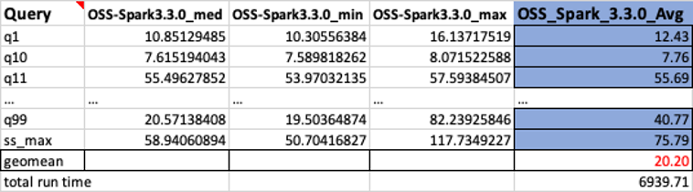

# Steps to run Spark Benchmarking

This repository provides a general tool to benchmark Spark performance on EC2 and EMR. We provide
1. [Steps to setup Open Source Spark benchmarking on EC2.](#steps-to-setup-oss-spark-benchmarking)
2. [Steps to perform similar benchmarking on EMR (EMR on EC2) using the EMR Spark Runtime .](#steps-to-setup-emr-on-ec2-benchmarking)
3. [Steps to perform similar benchmarking on EMR Serverless using the EMR Spark Runtime.](#steps-to-setup-emr-serverless-benchmarking)

## Steps to setup OSS Spark Benchmarking

We use an open source tool
[Flintrock](https://github.com/nchammas/flintrock) to launch our EC2 based [Apache
Spark](http://spark.apache.org/) cluster. Flintrock provides a quick way to launch an Apache Spark cluster on EC2 using command line.

### Pre-requisites

1\. Python 3.7.x or above

2\. pip3 22.2.2 or above

3\. Add the Python bin directory to your environment path. Flintrock
binary will be installed in this path. For example,

```
export PATH=$PATH:~/Library/Python/3.8/bin
```

4\. Run aws configure to configure your CLI shell to point to the
benchmarking account. Please refer to [Quick configuration with aws
configure](https://docs.aws.amazon.com/cli/latest/userguide/cli-configure-quickstart.html#cli-configure-quickstart-config)
for instructions.

5\. A [key
pair](https://docs.aws.amazon.com/AWSEC2/latest/UserGuide/create-key-pairs.html)
to access the OSS Spark primary node. Provide restrictive file permissions for the key pair pem/ppk file.
For example,

```
chmod 400 <key pair pem file>
```


6\. Create a new s3 bucket in your test account if needed. Replace
`$YOUR_S3_BUCKET` with your S3 bucket name. We suggest you export
`YOUR_S3_BUCKET` as an environment variable.

```
export YOUR_S3_BUCKET=<Your bucket name>
aws s3 mb s3://$YOUR_S3_BUCKET
```

7\. Copy the TPCDS source data as input to your S3 Bucket. If not
exported as an environment variable, replace $YOUR_S3_BUCKET with your
S3 bucket name.

```
aws s3 sync s3://blogpost-sparkoneks-us-east-1/blog/BLOG_TPCDS-TEST-3T-partitioned/ s3://$YOUR_S3_BUCKET/blog/BLOG_TPCDS-TEST-3T-partitioned/
```
8\. Build the benchmark application following the instructions provided in [Steps to build spark-benchmark-assembly application](build-instructions.md). For your convenience we have also provided a sample application jar file [spark-benchmark-assembly-3.3.0.jar](https://aws-bigdata-blog.s3.amazonaws.com/artifacts/oss-spark-benchmarking/spark-benchmark-assembly-3.3.0.jar) that we have built following the same steps.

### Deploy Spark Cluster and run benchmark job

1\. First, install the Flinkrock tool via pip

```
pip3 install flintrock
flintrock --version
```


2\. Run the command `flintrock configure`, which will pop up a default
configuration file. Then modify the default config.yaml file based on
your need. In the following example, replace `<YOUR_KEY_PAIR_NAME>` with
your ssh key pair. If you are running your test in a different region,
update the region name and replace ami with an [AMI (Amazon Machine
Image)](https://docs.aws.amazon.com/AWSEC2/latest/UserGuide/AMIs.html)
that is available in your test region.

```
services:
  spark:
    version: 3.3.0
    download-source: "https://archive.apache.org/dist/spark/spark-3.3.0/spark-3.3.0-bin-hadoop3.tgz"
  hdfs:
    version: 3.3.4
    download-source: "https://archive.apache.org/dist/hadoop/core/hadoop-3.3.4/"
provider: ec2
providers:
  ec2:
    key-name: master2-us-east-1-ec2-key-pair
    identity-file: /Users/srsekar/master2-us-east-1-ec2-key-pair.pem
    instance-type: c5d.9xlarge
    region: us-east-1
    ami: ami-05fa00d4c63e32376
    user: ec2-user
    instance-profile-name: EMR_EC2_DefaultRole
    min-root-ebs-size-gb: 20
    tenancy: default  # default | dedicated
    ebs-optimized: yes  # yes | no
    instance-initiated-shutdown-behavior: terminate  # terminate | stop

launch:
  num-slaves: 6
  install-hdfs: True
  install-spark: True
  java-version: 8

debug: false
```

Alternatively, copy and paste the [config.yaml
file](conf/config.yaml)
content to the default configure file. Then save the file to where it
was. In the table below we highlight key attributes in the config file
for this benchmark test:

| **Config file attribute name** | **value** |       
| ------------------------------ | --------- |      
| **spark version** | 3.3.0 (This is equivalent to the spark version in EMR 6.9) |
| **spark download-source**| "https://archive.apache.org/dist/spark/spark-3.3.0/spark-3.3.0-bin-hadoop3.tgz"      |
| **hdfs version** | 3.3.4 |
| **hdfs download-source** | "https://archive.apache.org/dist/hadoop/core/hadoop-3.3.4/"|
| **key-name** | Provide the name of your EC2 key pair |
| **identity-file**      | Provide the full path of the key pair you downloaded. For example: `/home/ec2-user/environment/master2-us-east-1-ec2-key-pair.pem`|
| **Instance-type**      | c5d.9xlarge |
| **region** | Your test region. Make sure the source data has been copied to the test region. For example: `us-east-1`|
| **ami** | `ami-05fa00d4c63e32376`  (The AMI for `us-east-1` used for this testing was: `ami-05fa00d4c63e32376 (Amazon Linux 2 AMI (HVM), SSD Volume Type (64-bit x86))`. AMIs get updated periodically. Please make sure you use the correct AMI for your region.)|
| **instance-profile-name** | `EMR_EC2_DefaultRole` Make sure this role exists in your account. By default EMR creates this role when launched on the Management console. You can manually create this role by running: `aws emr create-default-roles` Please refer the [CLI doc](https://docs.aws.amazon.com/cli/latest/reference/emr/create-default-roles.html). |
| **ebs-optimized**      | Yes                                         |
| **launch**             |                                             |
| **num-slaves**         | 6                                           |
| **install-hdfs**       | True                                        |
| **install-spark**      | True                                        |
| **java-version**       | 8                                           |

3\. Finally, launch the 7-node Spark cluster on EC2 via Flintrock
```
flintrock launch bigdata-cluster
```

This should create a Spark cluster with one primary node and 6 worker
nodes. If you see any error messages doublecheck the config file values,
especially the spark and Hadoop versions and the attributes of
download-source and AMI.

4\. The OSS Spark cluster doesn't come with YARN resource manager. To
enable it, we need to configure the cluster.

Download
[yarn-site.xml](conf/yarn-site.xml)
and
[enable-yarn.sh](scripts/enable-yarn.sh)

Or create two files based on the following code snippets. Open the
yarn-site.xml file and replace `<private ip of primary node>` with the
IP address of the primary node in your flintrock cluster. You can
retrieve the IP address from the EC2 console for the instance named
**bigdata-cluster-master.** *(The name may be different if you named
your flintrock cluster to have a different name in step 3 above)*

**yarn-site.xml**

```
<configuration>
    <property>
        <name>yarn.resourcemanager.hostname</name>
        <value>private ip of primary node</value>
    </property>
    <property>
        <name>yarn.log-aggregation-enable</name>
        <value>true</value>
    </property>
    <property>
        <name>yarn.nodemanager.resource.cpu-vcores</name>
        <value>36</value>
    </property>
        <property>
        <name>yarn.scheduler.maximum-allocation-vcores</name>
        <value>36</value>
    </property>
    <property>
        <name>yarn.scheduler.maximum-allocation-mb</name>
        <value>65536</value>
    </property>
    <property>
        <name>yarn.nodemanager.resource.memory-mb</name>
        <value>65536</value>
    </property>
</configuration>
```

**enable-yarn.sh**

```
#!/bin/sh
export HADOOP_PREFIX=/home/ec2-user/hadoop
echo "export HADOOP_PREFIX=$HADOOP_PREFIX" >> ~/.bashrc
echo "export HADOOP_HOME=$HADOOP_PREFIX" >> ~/.bashrc
echo "export HADOOP_COMMON_HOME=$HADOOP_PREFIX" >> ~/.bashrc
echo "export HADOOP_CONF_DIR=$HADOOP_PREFIX/conf" >> ~/.bashrc
echo "export HADOOP_HDFS_HOME=$HADOOP_PREFIX" >> ~/.bashrc
echo "export HADOOP_MAPRED_HOME=$HADOOP_PREFIX" >> ~/.bashrc
echo "export HADOOP_YARN_HOME=$HADOOP_PREFIX" >> ~/.bashrc
echo "export LD_LIBRARY_PATH=/home/ec2-user/hadoop/lib/native/" >> ~/.bashrc

cp $HADOOP_PREFIX/etc/hadoop/capacity-scheduler.xml $HADOOP_PREFIX/conf/
cp $HADOOP_PREFIX/etc/hadoop/log4j.properties $HADOOP_PREFIX/conf/

echo "export LD_LIBRARY_PATH=/lib64" >> $SPARK_HOME/conf/spark-env.sh
echo "export HADOOP_HOME=$HADOOP_PREFIX" >> $SPARK_HOME/conf/spark-env.sh
echo "export HADOOP_CONF_DIR=$HADOOP_PREFIX/conf" >> $SPARK_HOME/conf/spark-env.sh
echo "export SPARK_DIST_CLASSPATH=$HADOOP_PREFIX/share/hadoop" >> $SPARK_HOME/conf/spark-env.sh
```

Upload the files to all the node of the Spark cluster

```
flintrock copy-file bigdata-cluster yarn-site.xml ./hadoop/conf/
flintrock copy-file bigdata-cluster enable-yarn.sh ./
```
5\. Now run the enable-yarn script

```
flintrock run-command bigdata-cluster 'sh ~/enable-yarn.sh'
```

6\. Enable Snappy support in Hadoop: (benchmark job reads snappy
compressed data)

```
flintrock run-command bigdata-cluster 'sudo mount -o remount,exec /media/ephemeral0'
flintrock run-command bigdata-cluster 'sudo yum install -y snappy snappy-devel; ln -s /usr/lib64/libsnappy.so $HADOOP_HOME/lib/native/libsnappy.so'
```

7\. Copy the benchmark utility application JAR file spark-benchmark-assembly-3.3.0.jar that you had built earlier to the Flintrock cluster. Or if you are using Spark 3.3.0 you could download a pre-built jar: [spark-benchmark-assembly-3.3.0.jar](https://aws-bigdata-blog.s3.amazonaws.com/artifacts/oss-spark-benchmarking/spark-benchmark-assembly-3.3.0.jar)


```
flintrock copy-file bigdata-cluster spark-benchmark-assembly-3.3.0.jar ./
```

8\. Login to the primary node and start yarn

```
flintrock login bigdata-cluster

$HADOOP_HOME/sbin/start-yarn.sh
#check worker node status
yarn node --list

#check hdfs is running
hdfs dfs -ls /
```

If `yarn node --list` throws error, run `start-yarn.sh` script and make
sure it completed successfully.

If `hdfs dfs -ls /` returns errors, restart HDFS.

```
$HADOOP_HOME/sbin/start-dfs.sh
```

###### 9\. Submit the benchmark job.

Since you are now in the primary node of your Flintrock OSS Spark cluster, set `YOUR_S3_BUCKET` as an environment variable within this node as well.

```
export YOUR_S3_BUCKET=<Your bucket name>
```
Run the following command to submit the benchmark job on the open source Spark cluster.

```
spark-submit --master yarn \
--deploy-mode cluster \
--conf spark.driver.cores=4 \
--conf spark.driver.memory=5g \
--conf spark.executor.cores=4 \
--conf spark.executor.memory=6g \
--conf spark.executor.instances=47 \
--conf spark.executor.memoryOverhead=2G \
--conf spark.driver.memoryOverhead=1000 \
--conf spark.network.timeout=2000s \
--conf spark.executor.heartbeatInterval=300s \
--conf spark.dynamicAllocation.enabled=false \
--conf spark.shuffle.service.enabled=false \
--conf spark.hadoop.fs.s3a.aws.credentials.provider=com.amazonaws.auth.InstanceProfileCredentialsProvider \
--conf spark.hadoop.fs.s3a.impl=org.apache.hadoop.fs.s3a.S3AFileSystem \
--packages org.apache.hadoop:hadoop-aws:3.3.4 \
--class com.amazonaws.eks.tpcds.BenchmarkSQL \
spark-benchmark-assembly-3.3.0.jar \
s3a://$YOUR_S3_BUCKET/blog/BLOG_TPCDS-TEST-3T-partitioned s3a://$YOUR_S3_BUCKET/blog/EC2_TPCDS-TEST-3T-RESULT /opt/tpcds-kit/tools parquet 3000 3 false q1-v2.4,q10-v2.4,q11-v2.4,q12-v2.4,q13-v2.4,q14a-v2.4,q14b-v2.4,q15-v2.4,q16-v2.4,q17-v2.4,q18-v2.4,q19-v2.4,q2-v2.4,q20-v2.4,q21-v2.4,q22-v2.4,q23a-v2.4,q23b-v2.4,q24a-v2.4,q24b-v2.4,q25-v2.4,q26-v2.4,q27-v2.4,q28-v2.4,q29-v2.4,q3-v2.4,q30-v2.4,q31-v2.4,q32-v2.4,q33-v2.4,q34-v2.4,q35-v2.4,q36-v2.4,q37-v2.4,q38-v2.4,q39a-v2.4,q39b-v2.4,q4-v2.4,q40-v2.4,q41-v2.4,q42-v2.4,q43-v2.4,q44-v2.4,q45-v2.4,q46-v2.4,q47-v2.4,q48-v2.4,q49-v2.4,q5-v2.4,q50-v2.4,q51-v2.4,q52-v2.4,q53-v2.4,q54-v2.4,q55-v2.4,q56-v2.4,q57-v2.4,q58-v2.4,q59-v2.4,q6-v2.4,q60-v2.4,q61-v2.4,q62-v2.4,q63-v2.4,q64-v2.4,q65-v2.4,q66-v2.4,q67-v2.4,q68-v2.4,q69-v2.4,q7-v2.4,q70-v2.4,q71-v2.4,q72-v2.4,q73-v2.4,q74-v2.4,q75-v2.4,q76-v2.4,q77-v2.4,q78-v2.4,q79-v2.4,q8-v2.4,q80-v2.4,q81-v2.4,q82-v2.4,q83-v2.4,q84-v2.4,q85-v2.4,q86-v2.4,q87-v2.4,q88-v2.4,q89-v2.4,q9-v2.4,q90-v2.4,q91-v2.4,q92-v2.4,q93-v2.4,q94-v2.4,q95-v2.4,q96-v2.4,q97-v2.4,q98-v2.4,q99-v2.4,ss_max-v2.4 true
```
*Note: OSS Spark test didn't produce the query result for q95-v2.4 as it did not complete for us. So we reran the benchmark for the single q95-v2.4 query and merged the result back to the first test result set. We did not run into this issue when testing it on EMR.*

10\. Summarize the results

Download the test result file from the output S3 bucket
`s3://$YOUR_S3_BUCKET/EC2_TPCDS-TEST-3T-RESULT/timestamp=xxxx/summary.csv/xxx.csv`.
You could use the S3 console and navigate to the output S3 location or
use the CLI. Here is an example. If you have not exported
`YOUR_S3_BUCKET`, remember to provide your S3 bucket name prior to running
the commands below.

```
aws s3 ls s3://$YOUR_S3_BUCKET/blog/EC2_TPCDS-TEST-3T-RESULT/timestamp=xxxx/summary.csv/

2022-08-16 01:37:22          0 _SUCCESS
2022-08-16 01:37:22       5306 part-00000-10949163-064e-4439-8ea1-80437d629086-c000.csv
---------
aws s3 cp s3://$YOUR_S3_BUCKET/blog/EC2_TPCDS-TEST-3T-RESULT/timestamp=xxxx/summary.csv/part-00000-10949163-064e-4439-8ea1-80437d629086-c000.csv .

download: s3://$YOUR_S3_BUCKET/blog/EC2_TPCDS-TEST-3T-RESULT/timestamp=xxxx/summary.csv/part-00000-10949163-064e-4439-8ea1-80437d629086-c000.csv to ./part-00000-10949163-064e-4439-8ea1-80437d629086-c000.csv
----------
cat part-00000-10949163-064e-4439-8ea1-80437d629086-c000.csv

q1-v2.4,14.658507228000001,11.047176686999999,21.41753469
q10-v2.4,7.836089194,7.571201178,7.949175118
q11-v2.4,62.06816176,62.066219927,62.2317624
...
```

The spark benchmark application creates a timestamp folder and writes a
summary file inside a `summary.csv` prefix in S3. Your timestamp and filename
will be different from the one shown above.

The output CSV files have four columns without headername.They are:

1. query name
2. median time
3. minimum time
4. maximum time

Shown below is a sample output. We have manually added column names. The
way we calculate the geomean and the total job runtime is based on
arithmetic means. ie. we first take the mean of the med, min, and max
values using the formula `AVERAGE(B2:D2)`. Then we take a geometric mean
of the Avg column using the formula
`GEOMEAN(E2:E105)`.



## Steps to setup EMR on EC2 Benchmarking

### Pre-requisites

1\. Configure AWS CLI
Run aws configure to configure your CLI shell to point to the
benchmarking account. Please refer to [Quick configuration with aws
configure](https://docs.aws.amazon.com/cli/latest/userguide/cli-configure-quickstart.html#cli-configure-quickstart-config)
for instructions.

2\. Upload benchmark application to S3

```
aws s3 cp spark-benchmark-assembly-3.3.0.jar s3://$YOUR_S3_BUCKET/blog/jar/spark-benchmark-assembly-3.3.0.jar
```

### Deploy EMR on EC2 Cluster and run benchmark job

1\. Spin up EMR in CLI Shell using command line. Configure EMR with 1
primary (`c5d.9xlarge`) and 6 Core (`c5d.9xlarge`) nodes. Prior to running
the command below replace the values for the following from your
environment

`<YOUR_KEY_PAIR_NAME>` - Your key pair for ssh access to EMR.

`<YOUR_SUBNET_ID>` - Specify the VPC subnet in which to create the EMR cluster.

`<YOUR_SLAVE_SG>` - This is the security group for your EMR core nodes. You can find this from EMR console.

`<YOUR_MASTER_SG>` - This is the security group that allows access to your EMR primary node.

`$YOUR_S3_BUCKET` - If not exported as an environment variable, replace this with your S3 bucket name.

`<YOUR_CLUSTER_NAME>` - Provide a cluster name.

Please refer to
[create-cluster](https://awscli.amazonaws.com/v2/documentation/api/latest/reference/emr/create-cluster.html)
for detailed description for each option.

```
aws emr create-cluster \
--applications Name=Hadoop Name=Spark \
--ec2-attributes '{"KeyName":"<YOUR_KEY_PAIR_NAME>","InstanceProfile":"EMR_EC2_DefaultRole","SubnetId":"<YOUR_SUBNET_ID>","EmrManagedSlaveSecurityGroup":"<YOUR_SLAVE_SG>","EmrManagedMasterSecurityGroup":"<YOUR_MASTER_SG>"}' \
--release-label emr-6.9.0 \
--log-uri s3://$YOUR_S3_BUCKET/elasticmapreduce/ \
--instance-groups '[{"InstanceCount":6,"EbsConfiguration":{"EbsOptimized":true},"InstanceGroupType":"CORE","InstanceType":"c5d.9xlarge","Name":"Core - 2"},{"InstanceCount":1,"EbsConfiguration":{"EbsOptimized":true},"InstanceGroupType":"MASTER","InstanceType":"c5d.9xlarge","Name":"Master - 1"}]' \
--auto-scaling-role EMR_AutoScaling_DefaultRole \
--ebs-root-volume-size 10 \
--service-role EMR_DefaultRole \
--enable-debugging \
--name <YOUR_CLUSTER_NAME> \
--scale-down-behavior TERMINATE_AT_TASK_COMPLETION \
--region <YOUR_TEST_REGION>
```

Store the cluster id from the response. You will need need this in the
next step. You can also export the cluster id to an environment variable.

```
{
    "ClusterId": "j-3T7T1GLEL5BVB",
    "ClusterArn": "arn:aws:elasticmapreduce:us-east-1:012345678912:cluster/j-3T7T1GLEL5BVB"
}

export YOUR_CLUSTERID=j-3T7T1GLEL5BVB
```

2\. Run the following command to submit the benchmark job in EMR using
add-steps CLI. If you have not exported the environment variables, prior
to running the command below replace the values for the following from
your environment:

`$YOUR_CLUSTERID`

`$YOUR_S3_BUCKET` - Your bucket name.

```
aws emr add-steps \
        --cluster-id $YOUR_CLUSTERID  \
        --steps Type=Spark,Name="TPCDS Benchmark Job",Args=[--deploy-mode,cluster,--class,com.amazonaws.eks.tpcds.BenchmarkSQL,--conf,spark.driver.cores=4,--conf,spark.driver.memory=5g,--conf,spark.executor.cores=4,--conf,spark.executor.memory=6g,--conf,spark.executor.instances=47,--conf,spark.network.timeout=2000,--conf,spark.executor.heartbeatInterval=300s,--conf,spark.executor.memoryOverhead=2G,--conf,spark.driver.memoryOverhead=1000,--conf,spark.dynamicAllocation.enabled=false,--conf,spark.shuffle.service.enabled=false,s3://$YOUR_S3_BUCKET/blog/jar/spark-benchmark-assembly-3.3.0.jar,s3://$YOUR_S3_BUCKET/blog/BLOG_TPCDS-TEST-3T-partitioned,s3://$YOUR_S3_BUCKET/blog/EMRONEC2_TPCDS-TEST-3T-RESULT,/opt/tpcds-kit/tools,parquet,3000,3,false,'q1-v2.4\,q10-v2.4\,q11-v2.4\,q12-v2.4\,q13-v2.4\,q14a-v2.4\,q14b-v2.4\,q15-v2.4\,q16-v2.4\,q17-v2.4\,q18-v2.4\,q19-v2.4\,q2-v2.4\,q20-v2.4\,q21-v2.4\,q22-v2.4\,q23a-v2.4\,q23b-v2.4\,q24a-v2.4\,q24b-v2.4\,q25-v2.4\,q26-v2.4\,q27-v2.4\,q28-v2.4\,q29-v2.4\,q3-v2.4\,q30-v2.4\,q31-v2.4\,q32-v2.4\,q33-v2.4\,q34-v2.4\,q35-v2.4\,q36-v2.4\,q37-v2.4\,q38-v2.4\,q39a-v2.4\,q39b-v2.4\,q4-v2.4\,q40-v2.4\,q41-v2.4\,q42-v2.4\,q43-v2.4\,q44-v2.4\,q45-v2.4\,q46-v2.4\,q47-v2.4\,q48-v2.4\,q49-v2.4\,q5-v2.4\,q50-v2.4\,q51-v2.4\,q52-v2.4\,q53-v2.4\,q54-v2.4\,q55-v2.4\,q56-v2.4\,q57-v2.4\,q58-v2.4\,q59-v2.4\,q6-v2.4\,q60-v2.4\,q61-v2.4\,q62-v2.4\,q63-v2.4\,q64-v2.4\,q65-v2.4\,q66-v2.4\,q67-v2.4\,q68-v2.4\,q69-v2.4\,q7-v2.4\,q70-v2.4\,q71-v2.4\,q72-v2.4\,q73-v2.4\,q74-v2.4\,q75-v2.4\,q76-v2.4\,q77-v2.4\,q78-v2.4\,q79-v2.4\,q8-v2.4\,q80-v2.4\,q81-v2.4\,q82-v2.4\,q83-v2.4\,q84-v2.4\,q85-v2.4\,q86-v2.4\,q87-v2.4\,q88-v2.4\,q89-v2.4\,q9-v2.4\,q90-v2.4\,q91-v2.4\,q92-v2.4\,q93-v2.4\,q94-v2.4\,q95-v2.4\,q96-v2.4\,q97-v2.4\,q98-v2.4\,q99-v2.4\,ss_max-v2.4',true],ActionOnFailure=CONTINUE

```

3\. Summarize the results from the output bucket
`s3://$YOUR_S3_BUCKET/blog/EMRONEC2_TPCDS-TEST-3T-RESULT` in the same
manner as we did for the OSS results and compare.

### Cleanup

Download [scripts/cleanup-benchmark-env.sh](scripts/cleanup-benchmark-env.sh) to the benchmark environment.

1. If you have cloned this repository locally, change to the `scripts` directory in your **benchmark environment**. Make sure you edit the cleanup-benchmark-env.sh script and provide your `S3 bucket name`, your `EMR cluster ID` and your `OSS Spark cluster ID`. Run:

```
    ./cleanup-benchmark-env.sh
```

2. If you used Cloud9 as your build environment, **outside your Cloud9 environment**, from any terminal where you have AWS CLI installed, run:

```
   export CLOUD9_ENV_ID=<cloud9 environment id>
   aws cloud9 delete-environment --environment-id $CLOUD9_ENV_ID

```

## Steps to setup EMR Serverless Benchmarking

### Pre-requisites

1\.  Follow pre-requisite steps to setup EMR Serverless (Permissions, Storage, Runtime Roles) using link below:
https://docs.aws.amazon.com/emr/latest/EMR-Serverless-UserGuide/getting-started.html#gs-prerequisites


2\. Configure AWS CLI
Run aws configure to configure your CLI shell to point to the
benchmarking account. Please refer to [Quick configuration with aws
configure](https://docs.aws.amazon.com/cli/latest/userguide/cli-configure-quickstart.html#cli-configure-quickstart-config)
for instructions.

(If you have configured AWS CLI as part of previous steps, you can skip them):

### Create an EMR Serverless application:

1\. Create EMR application using sample CLI below (replace subnet Ids and Security groups Ids with your environment configuration) 

```
export AWS_REGION=us-east-1  #Change per your requirement
export EMR_RELEASE=emr-6.9.0 #EMR Release Label

aws emr-serverless create-application --name "spark-defaults-v1" --type SPARK --release-label $EMR_RELEASE --architecture "ARM64" --region $AWS_REGION  --initial-capacity '{
                                          "DRIVER": {
                                              "workerCount": 1,
                                              "workerConfiguration": {
                                                  "cpu": "4vCPU",
                                                  "memory": "16GB",
                                                  "disk": "120GB"
                                              }
                                          },
                                          "EXECUTOR": {
                                              "workerCount": 100,
                                              "workerConfiguration": {
                                                  "cpu": "4vCPU",
                                                  "memory": "16GB",
                                                "disk": "120GB"
                                              }
                                          }
}'  --network-configuration '{"subnetIds": ["subnet-XXXXXX", "subnet-YYYYY"], "securityGroupIds": ["sg-xxxxxyyyyyzzzz"]}'
```

2\. Submit job to the EMR Serverless application created in previous step using sample CLI below.

Make sure runtime role https://docs.aws.amazon.com/emr/latest/EMR-Serverless-UserGuide/security-iam-runtime-role.html has the appropriate s3 access to read and write from your S3 buckets, replace highlighted example bucket, if you are using different region from us-east-1, replace region and copy benchmark jar to your bucket in appropriate region where job will be submitted.

```
export APP_ID=00xxxxp6vmdyyyyy                                  #Your EMR Serverless Application Id from Previous Step 
export RUNTIMEROLE="arn:aws:iam::333333333333:role/runtimerole" #Runtime role setup from pre-req
export YOURBUCKET=aws-emr-xxxxxx-yyyy                           #S3 bucket to write logs and benchmark results
export query='q1-2.4\,q2-2.4'                                   #option query param, can skip if all tpc-ds queries are run
export AWS_REGION=us-east-1                                     #region where app was created

aws emr-serverless start-job-run --application-id $APP_ID \
--execution-role-arn "$RUNTIMEROLE" \
--job-driver '{"sparkSubmit": {"entryPoint": "s3://ee-assets-prod-us-east-1/modules/0b22764e47c84c3ab594fc804031cbcd/v1/eks-spark-benchmark-assembly-3.3.0.jar","entryPointArguments": ["s3://blogpost-sparkoneks-us-east-1/blog/BLOG_TPCDS-TEST-3T-partitioned","s3://'$YOURBUCKET'/spark/EMRSERVERLESS_TPCDS-TEST-3T-RESULT","/opt/tpcds-kit/tools","parquet","3000","3","false",'q1-v2.4\,q10-v2.4\,q11-v2.4\,q12-v2.4\,q13-v2.4\,q14a-v2.4\,q14b-v2.4\,q15-v2.4\,q16-v2.4\,q17-v2.4\,q18-v2.4\,q19-v2.4\,q2-v2.4\,q20-v2.4\,q21-v2.4\,q22-v2.4\,q23a-v2.4\,q23b-v2.4\,q24a-v2.4\,q24b-v2.4\,q25-v2.4\,q26-v2.4\,q27-v2.4\,q28-v2.4\,q29-v2.4\,q3-v2.4\,q30-v2.4\,q31-v2.4\,q32-v2.4\,q33-v2.4\,q34-v2.4\,q35-v2.4\,q36-v2.4\,q37-v2.4\,q38-v2.4\,q39a-v2.4\,q39b-v2.4\,q4-v2.4\,q40-v2.4\,q41-v2.4\,q42-v2.4\,q43-v2.4\,q44-v2.4\,q45-v2.4\,q46-v2.4\,q47-v2.4\,q48-v2.4\,q49-v2.4\,q5-v2.4\,q50-v2.4\,q51-v2.4\,q52-v2.4\,q53-v2.4\,q54-v2.4\,q55-v2.4\,q56-v2.4\,q57-v2.4\,q58-v2.4\,q59-v2.4\,q6-v2.4\,q60-v2.4\,q61-v2.4\,q62-v2.4\,q63-v2.4\,q64-v2.4\,q65-v2.4\,q66-v2.4\,q67-v2.4\,q68-v2.4\,q69-v2.4\,q7-v2.4\,q70-v2.4\,q71-v2.4\,q72-v2.4\,q73-v2.4\,q74-v2.4\,q75-v2.4\,q76-v2.4\,q77-v2.4\,q78-v2.4\,q79-v2.4\,q8-v2.4\,q80-v2.4\,q81-v2.4\,q82-v2.4\,q83-v2.4\,q84-v2.4\,q85-v2.4\,q86-v2.4\,q87-v2.4\,q88-v2.4\,q89-v2.4\,q9-v2.4\,q90-v2.4\,q91-v2.4\,q92-v2.4\,q93-v2.4\,q94-v2.4\,q95-v2.4\,q96-v2.4\,q97-v2.4\,q98-v2.4\,q99-v2.4\,ss_max-v2.4',"true"],"sparkSubmitParameters": "--class com.amazonaws.eks.tpcds.BenchmarkSQL"}}' \
--configuration-overrides '{"monitoringConfiguration": {"s3MonitoringConfiguration": {"logUri": "s3://'$YOURBUCKET'/spark/logs/"}}}' \
--region "$AWS_REGION"
```

3\. Summarize the results from the output bucket
`s3://'$YOURBUCKET'/spark/EMRSERVERLESS_TPCDS-TEST-3T-RESULT` in the same manner as we did for the OSS results and compare.

#### Run an Amazon EMR Serverless job with multiple CPU architectures:

The architecture of your Amazon EMR Serverless application determines the type of processors that the application uses to run the job. Amazon EMR provides two architecture options for your application: x86_64 and arm64.
By default, when you create an EMR Serverless without specifying CPU architecture (via CLI/API), application uses x86_64 processors.

If you’re evaluating migrating to Graviton2 architecture on Amazon EMR Serverless workloads, we recommend testing the Spark workloads based on your real-world use cases. If you need to run workloads across multiple processor architectures, for example test the performance for Intel and Arm CPUs, follow the walkthrough in this section to get started with some concrete ideas.

### Build two EMR Serverless applications, one with x86 and another with Graviton2 (ARM64):

1\.  Create **Graviton2 (ARM64)** EMR application using sample CLI below (replace subnet Ids and Security groups Ids with your environment configuration) 

```
aws emr-serverless create-application --name "spark-ARM64-defaults-v1" --type SPARK --release-label emr-6.9.0 --architecture "ARM64" --region us-east-1 --initial-capacity '{
                                          "DRIVER": {
                                              "workerCount": 1,
                                              "workerConfiguration": {
                                                  "cpu": "4vCPU",
                                                  "memory": "16GB",
                                                  "disk": "200GB"
                                              }
                                          },
                                          "EXECUTOR": {
                                              "workerCount": 100,
                                              "workerConfiguration": {
                                                  "cpu": "4vCPU",
                                                  "memory": "16GB",
                                                  "disk": "200GB"
                                              }
                                          }
}'  --network-configuration '{"subnetIds": ["subnet-XXXXX","subnet-YYYYY"], "securityGroupIds": ["sg-YYYY"]}'
```

2\. Create **x86** EMR application using sample CLI below (replace subnet Ids and Security groups Ids with your environment configuration) 

```
aws emr-serverless create-application --name "spark-x86-defaults-v1" --type SPARK --release-label emr-6.9.0 --region us-east-1  --initial-capacity '{
                                          "DRIVER": {
                                              "workerCount": 1,
                                              "workerConfiguration": {
                                                  "cpu": "4vCPU",
                                                  "memory": "16GB",
                                                  "disk": "200GB"
                                              }
                                          },
                                          "EXECUTOR": {
                                              "workerCount": 100,
                                              "workerConfiguration": {
                                                  "cpu": "4vCPU",
                                                  "memory": "16GB",
                                                "disk": "200GB"
                                              }
                                          }
}'  --network-configuration '{"subnetIds": ["subnet-XXXXX","subnet-YYYYY"], "securityGroupIds": ["sg-YYYYYY"]}'
```


3\. Submit jobs to the applications created in previous step using sample CLI below. You need to submit jobs to both applications, once you test a sample job, you can use script below to loop through all queries.

Make sure runtime role https://docs.aws.amazon.com/emr/latest/EMR-Serverless-UserGuide/security-iam-runtime-role.html has the appropriate s3 access to read and write from your S3 buckets, replace highlighted example bucket, if you are using different region from us-east-1, replace region and copy benchmark jar to your bucket in appropriate region where job will be submitted.

```
export APP_ID=00xxxxp6vmdyyyyy                                  #Your EMR Serverless Application Id from Previous Step 
export RUNTIMEROLE="arn:aws:iam::333333333333:role/runtimerole" #Runtime role setup from pre-req
export YOURBUCKET=aws-emr-xxxxxx-yyyy                           #S3 bucket to write logs and benchmark results
export query='q1-2.4\,q2-2.4'                                   #option query param, can skip if all tpc-ds queries are run
export AWS_REGION=us-east-1                                     #region where app was created

aws emr-serverless start-job-run --application-id $APP_ID \
--execution-role-arn "$RUNTIMEROLE" \
--job-driver '{"sparkSubmit": {"entryPoint": "s3://ee-assets-prod-us-east-1/modules/0b22764e47c84c3ab594fc804031cbcd/v1/eks-spark-benchmark-assembly-3.3.0.jar","entryPointArguments": ["s3://blogpost-sparkoneks-us-east-1/blog/BLOG_TPCDS-TEST-3T-partitioned","s3://'$YOURBUCKET'/spark/EMRSERVERLESS_TPCDS-TEST-3T-RESULT","/opt/tpcds-kit/tools","parquet","3000","3","false",'$query',"true"],"sparkSubmitParameters": "--class com.amazonaws.eks.tpcds.BenchmarkSQL"}}' \
--configuration-overrides '{"monitoringConfiguration": {"s3MonitoringConfiguration": {"logUri": "s3://'$YOURBUCKET'/spark/logs/"}}}' \
--region "$AWS_REGION"
```

**Run all TPC-DS queries in loop via bash script:**  
You can use below sample script to loop through multiple TPC-DS queries.
Copy below code snippet into a shell script:

```
#!/bin/bash

APP_ID=$1
export AWS_REGION="us-east-1"

arr=("q21-v2.4" "q22-v2.4" "q23a-v2.4" "q23b-v2.4" "q24a-v2.4" "q24b-v2.4" "q25-v2.4" "q26-v2.4" "q27-v2.4" "q28-v2.4" "q29-v2.4" "q3-v2.4" "q30-v2.4" "q31-v2.4" "q32-v2.4" "q33-v2.4" "q34-v2.4" "q35-v2.4" "q36-v2.4" "q37-v2.4" "q38-v2.4" "q39a-v2.4" "q39b-v2.4" "q4-v2.4" "q40-v2.4")

function run_benchmark(){
        for (( i = 0; i < "${#arr[@]}"; i++ )); do
                        echo  "${arr[$i]}"
                        job_id=$(bash submit_tpcds-v1.sh "${arr[$i]}" "$APP_ID" | jq -c '.jobRunId')
                        job_id=$(echo "$job_id" | tr -d '"')
                        state=""
                        while [[ "$state" != "SUCCESS" ]] && [[ "$state" != "FAILED" ]] && [[ "$state" != "CANCELLED" ]];
                        do
                         output=$(/usr/local/bin/aws emr-serverless get-job-run --application-id $APP_ID --job-run-id $job_id  --region $AWS_REGION | jq -c '.jobRun.state')
                         #Sleep before checking job status
                         sleep 30
                         state=`sed -e 's/^"//' -e 's/"$//' <<<"$output"`
                        done
                        #2 minutes sleep for EMR Serverless App to stop, replenish resources for next query run
                        #sleep 120;
                        /usr/local/bin/aws emr-serverless stop-application --application-id $APP_ID --region $AWS_REGION
                        sleep 90;
                        echo "`date +%m-%d-%YT%T` Ran job with "${arr[$i]}"  job id: $job_id"
                        echo "Status of query ${arr[$i]} with job_id: $job_id is $state"
        done
}

g=1
for (( k = 0; k < $g; k++ )); do
        echo "running iteration $k"
        run_benchmark
done
```

Run the bash script created in previous as below:

```
export APP_ID=xyyolffnjgkkg
bash sample_loop_script.sh $APP_ID
```

**Note** submit_tpcds-v1.sh sample bash for job submission is below:

```
export APP_ID=$1                                                #Your EMR Serverless Application Id from Previous Step 
export query=$2                                                 #option query param, can skip if all tpc-ds queries are run
export RUNTIMEROLE="arn:aws:iam::333333333333:role/runtimerole" #Runtime role setup from pre-req
export YOURBUCKET=aws-emr-xxxxxx-yyyy                           #S3 bucket to write logs and benchmark results
export AWS_REGION=us-east-1                                     #region where app was created

aws emr-serverless start-job-run --application-id $APP_ID \
--execution-role-arn "$RUNTIMEROLE" \
--job-driver '{"sparkSubmit": {"entryPoint": "s3://ee-assets-prod-us-east-1/modules/0b22764e47c84c3ab594fc804031cbcd/v1/eks-spark-benchmark-assembly-3.3.0.jar","entryPointArguments": ["s3://blogpost-sparkoneks-us-east-1/blog/BLOG_TPCDS-TEST-3T-partitioned","s3://'$YOURBUCKET'/spark/EMRSERVERLESS_TPCDS-TEST-3T-RESULT","/opt/tpcds-kit/tools","parquet","3000","3","false",'$query',"true"],"sparkSubmitParameters": "--class com.amazonaws.eks.tpcds.BenchmarkSQL"}}' \
--configuration-overrides '{"monitoringConfiguration": {"s3MonitoringConfiguration": {"logUri": "s3://'$YOURBUCKET'/spark/logs/"}}}' \
--region "$AWS_REGION"
```


*Note:* Benchmark results will be available in your s3 bucket that was specified during the job submission.
Sample output of results:

4\. Summarize the results from the output bucket
`s3://$YOUR_S3_BUCKET/blog/EMRSERVERLESS_TPCDS-TEST-3T-RESULT` in the same manner as we did for the OSS results and compare.
